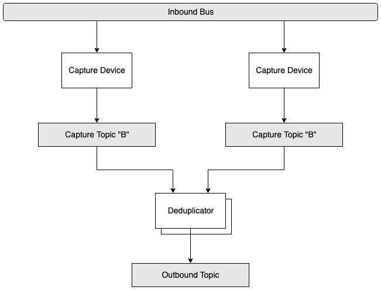

# KafkaCap
#### Reliably Capture Messages to Kafka 

This is a work-on-progress. Pardon my dust.

## Architecture
* 2 or more Capture Devices write to separate Kafka Topics
* A Deduplicator process listens to the Capture Device topics and writes unique messages to a single Kafka Topic 
* Multiple Deduplicator processes with the same Kafka Consumer `group.id` run to provide fault-tolerance 

## Core
Full Details: [Core](kafkacap-core)

### Capture Device
"Bring Your Own Receiver" - An abstract CaptureDevice class allows simple plug-and-play

### Deduplicator
Instantiate a Deduplicator with a custom DedupStrategy to generate a unified outbound topic. Downstream consumers can treat the outbound topic as any normal Kafka topic, while having high confidence that all messages are captured and appropriately ordered. 

## Provided Implementations

### Capture Devices
* [Aeron](kafkacap-aeron)
* [Multicast](kafkacap-multicast)