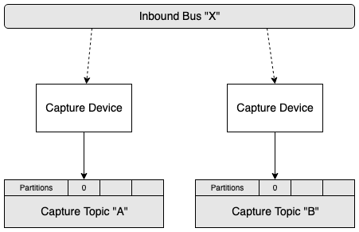
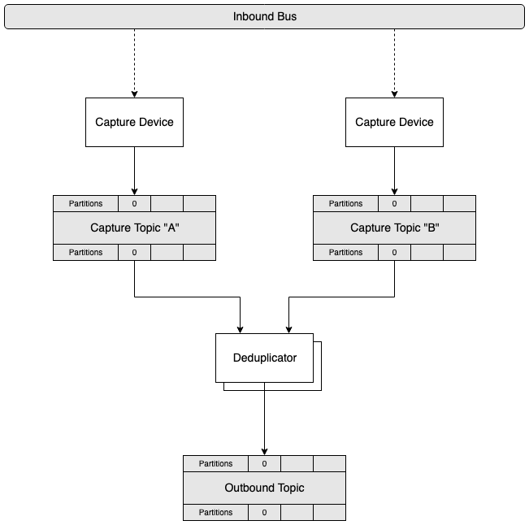
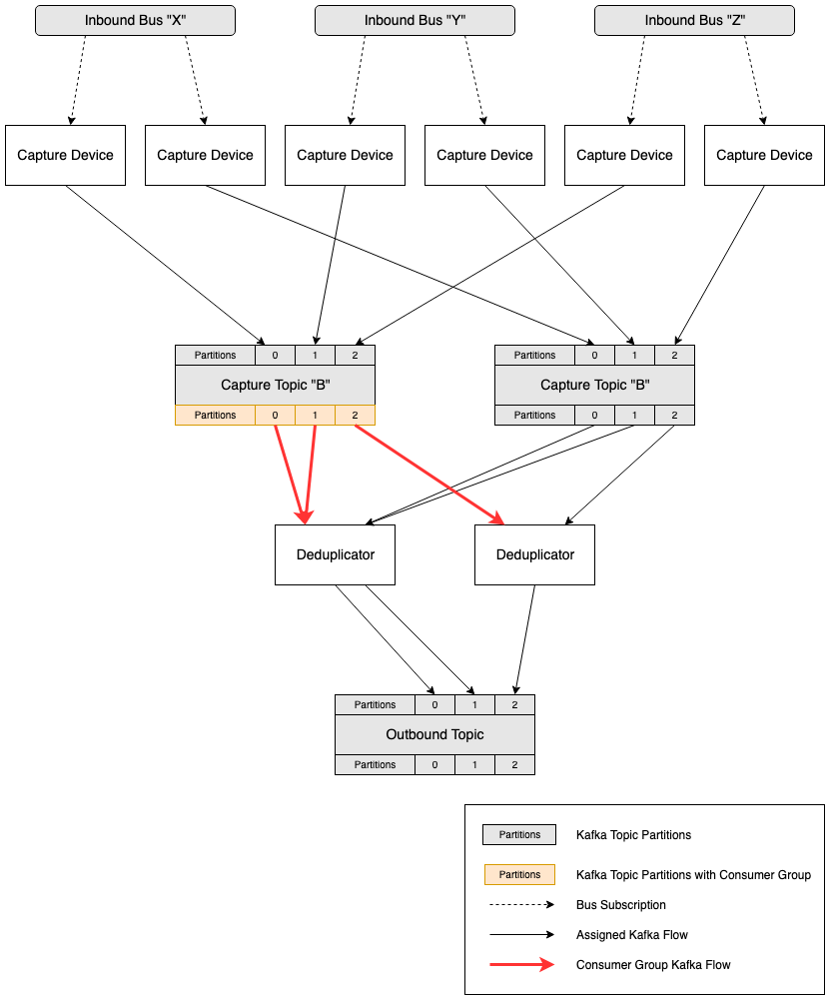

# KafkaCap Core
Reliably Capture Messages to Kafka using redundant Capture Devices and a Deduplicator Consumer Group


## Capture

### Capture Overview
A single process that listens to a stream of messages, buffers them to a queue, and publishes them to a single Kafka Topic. On its own, this process is not fault-tolerant and its outbound topic is not guaranteed to contain all messages sent on the inbound transport. 



### Queueing
A Capture process queues messages before writing them to Kafka. This is done to reduce back-pressure on the receiver. A sufficiently large queue will also be able to queue messages during a full Kafka outage until the outage is resolved. 
* In-Memory: `MemoryCaptureQueue` will queue all received messages in-memory. Capacity is limited by the underlying queue implementation and the JVM heap size. 
* Chronicle: `ChronicleCaptureQueue` will queue all messages to disk using [Chronicle-Queue](https://github.com/OpenHFT/Chronicle-Queue). Capacity is limited only by available disk space. This implementation is recommended when messages must be captured and buffered in the event of a Kafka Cluster outage.

### Capture Device
`io.thill.kafkacap.core.capture.CaptureDevice` is an abstract class that allows simple plug-and-play of any poll-based receiver. It handles most of the ceremony of creating a typical `BufferedPublisher` with an underlying `ChronicleCaptureQueue`
 
### Buffered Publisher
For additional flexibility, a `BufferedPublisher` can be instantiated and used directly, instead of relying on the abstraction of a `CaptureDevice`.

```
BufferedPublisher<byte[], byte[]> bufferedPublisher = new BufferedPublisherBuilder<byte[], byte[]>()
        .captureQueue            ( new MemoryCaptureQueue() )
        .recordPopulator         ( new DefaultRecordPopulator<>("my_topic_capture_a", 0, new SystemMillisClock()) )
        .kafkaProducerProperties ( kafkaProducerProperties )
        .build();
```


## Deduplicate

### Deduplicator Overview
A Kafka Consumer Group that is responsible for deduplicating messages from redundant capture topics



### DedupStrategy
Deduplication logic relies on the user's implementation of `io.thill.kafkacap.core.dedup.strategy.DedupStrategy`. All received messages from all capture topics will be checked by the strategy and must return `SEND`, `DROP`, or `CACHE`. 
* `SEND` - Send this message immediately
* `DROP` - Drop this messages indefinitely
* `CACHE` - Add this message to a per-capture-topic cache, so it can be tried again very soon.

### SequencedDedupStrategy
For streams consisting of a sequenced stream of messages, an abstract class called `SequencedDedupStrategy` is provided. 
The user must simply implement `long parseSequence(ConsumerRecord<K, V> record)` to parse the sequence from the captured messages. 
Notes:
* The sequence is assumed to be unsigned
* Each partition in the topic is assumed to be a separate stream of sequenced messages

### MultiProducerDedupStreategy
For physical streams consisting of multiple logical streams, where ordering is only guaranteed per inbound producer, an abstract class called `MultiProducerDedupStreategy` is provided.
The user must simply implement `String parseProducerKey(ConsumerRecord<K, V> record)` to parse a producer key.  
Notes:
* A separate underlying DedupStrategy will be created per producer using the given `DedupStrategyFactory`

### Kafka Partitions
As far as the deduplicator is concerend, inboundPartition == outboundPartition, and messages will be published as such. For situations where `numPartitions > 0`, `DedupStrategy` implementations must take care of all per-partition logic by checking the `ConsumerRecord`'s partition.

### Kafka Consumer Groups
The Deduplicator relies on Kafka Consumer Groups for fault tolerance. Since it consumes multiple inbound topics which must be deduplicated, the first topic in the `inboundTopics` list is used for topic subscription / partition assignment. Upon partition assignment for this first topic from the Kafka Cluster, all other topics will be manually assigned to match the same partition assignment. This allows multi-partition schemes to be load balanced between all available deduplicator processes in the consumer group. 



## Running
```
io.thill.kafkacap.core.Deduplicator /path/to/config.yaml
```

## Configuration

```
consumerGroupIdPrefix: demo_
consumer:
  bootstrap.servers: "localhost:9092"
  key.deserializer: "org.apache.kafka.common.serialization.ByteArrayDeserializer"
  value.deserializer: "org.apache.kafka.common.serialization.ByteArrayDeserializer"
producer:
  bootstrap.servers: "localhost:9092"
  key.serializer: "org.apache.kafka.common.serialization.ByteArraySerializer"
  value.serializer: "org.apache.kafka.common.serialization.ByteArraySerializer"
inboundTopics:
  - "capture_A"
  - "capture_B"
outboundTopic: "outbound"
dedupStrategy: "io.thill.kafkacap.core.dedup.strategy.TestableSequencedDedupStrategy"
orderedCapture: false
```

## Builder
For added flexibility, a `Deduplicator` can be instantiated and started in code using the `DeduplicatorBuilder`.

```
DedupStrategy myDedupStrategy = ...
Deduplicator deduplicator = new DeduplicatorBuilder<>()
  .dedupStrategy         ( myDedupStrategy )
  .consumerGroupIdPrefix ( "mydeduplicator_" )
  .outboundTopic         ( "my_topic" )
  .inboundTopics         ( Arrays.asList("my_topic_capture_a", "my_topic_capture_b") )  
  .consumerProperties    ( consumerProperties )
  .producerProperties    ( producerProperties )
  .recordCacheFactory    ( MemoryRecordCache.factory() )
  .orderedCapture        ( false )
  .build();
```